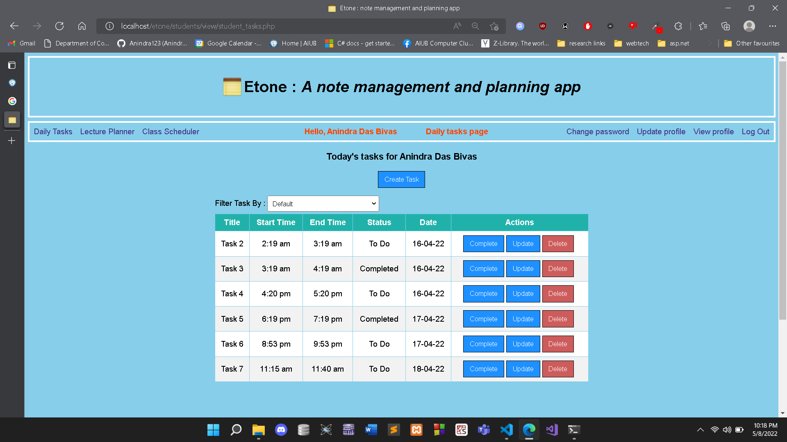

# Etone
A note management and planning app

CSC3215 : Web Technologies course project

## What we learnt bulding this project
- Developing full scale web apps
- How request response cycle of a web app works
- Making dynamic website and becoming familiar with server side language
- Getting to know about MVC pattern and how to seperate different parts of code base for enforcing seperation of concern for better mantainability of code
- Different layers of validation
- How different techonologies ex:HTML,CSS,PHP,JS contribute to overall application and user experience
- Important web concepts such as :
    - Session
    - Cookies
    - AJAX
    - Request Header
    - Web Resource
    - Response code
    - Port
    - HTTP and HTTPS
 
 

## Things to further learn
- JQuery
- A web framework such as ASP.NET
 
 

## System screenshots

